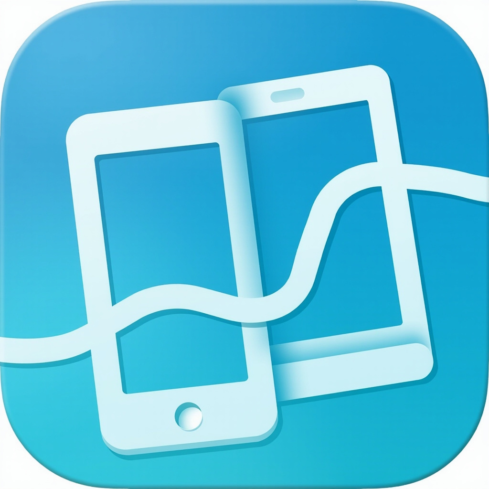

<p align="center">
  
</p>

<h1 align="center">PhoneBridge</h1>

<p align="center">
  <em>LAN-first, self-hosted, cross-platform bridge to manage multiple Android phones from a single message-center.</em>
</p>

<p align="center">
  <a href="README.md">English</a> · <a href="README.zh.md">简体中文</a>
</p>

**Status:** 🚧 Pre-alpha / under active development. MVP scope: device pairing, notification sync, SMS send/receive, call control. Milestones: M0 ✅ scaffold · M1 ✅ message-center core · M2 ✅ discovery / pairing / WebSocket · M3 ✅ business channels · M4 ✅ CI / OpenAPI / live push · M5 ✅ Android client · **M6 hardening** ✅ (Android Keystore-backed identity, swipe-to-dismiss reverse channel, robust `SmsReceiver`, persistent WS).

## What it is

A three-component system:

- **Android Agent** (Kotlin + Jetpack Compose, package `im.zyx.phonebridge`): registers on the LAN via mDNS, runs a foreground service, and forwards notifications / SMS / call state to the message-center over a TLS+WebSocket connection.
- **Message Center** (Rust, binary `message-center`): the central broker. A single binary, no native GUI. Hosts the local web console, the WebSocket endpoints, and the mDNS responder. It fans Android events out to two surfaces: the web console and the desktop notification endpoint.
- **Desktop Notifier** (Rust, binary `phonebridge-display`): subscribes to `/ws/display` on the message-center and surfaces phone events via the host OS notification surface (Linux: `org.freedesktop.Notifications`; macOS / Windows: planned).

No cloud. No telemetry. No account. Works fully offline on a local network.

Inspired by KDE Connect and Microsoft Phone Link; explicitly focused on stable notification + SMS sync.

## Architecture

```
                                       ┌──────────────┐
                                       │  Desktop     │
                                       │  Notifier    │
                                       │ (Rust binary)│
                                       └──────▲───────┘
                                              │ /ws/display
                                              │
┌──────────┐    TLS+WS    ┌────────────────┐   │   ┌──────────┐
│ Android  │ ◀─────────▶  │ Message Center │   │   │ Browser  │
│ Agent    │              │ (Rust binary)  │ ◀─┴─▶│          │
│ (Kotlin) │              │   - SQLite     │       │          │
└──────────┘              │   - mDNS       │       └──────────┘
                          │   - Web console│
                          └────────────────┘
```

The three components communicate as follows:

- **Android Agent ↔ Message Center**: full-duplex `Envelope` frames over TLS+WebSocket. The agent is always the WS client.
- **Desktop Notifier → Message Center**: subscribes to `/ws/display?token=<hex>`; receives phone events and sends back `quick-reply` / `mark-read` / `dismiss` actions.
- **Browser → Message Center**: standard HTTP for REST + WebSocket for live event push (`/ws/console`).

## Repository layout

```
MessageHub/                         # upstream repo: github.com/2926295173/MessageHub
├── crates/                         # Rust workspace
│   ├── phonebridge-proto/          # Wire protocol types (JSON Schema backed)
│   ├── phonebridge-core/           # Config, paths, logging, errors
│   ├── phonebridge-crypto/         # ECDH P-256, HKDF, self-signed certs
│   ├── phonebridge-net/            # mDNS + WebSocket handlers
│   ├── phonebridge-storage/        # sqlx migrations + models
│   ├── phonebridge-bus/            # In-process event bus (plugin hook reserve)
│   ├── message-center/             # Main binary (the central broker)
│   └── phonebridge-display/        # Desktop notifier (subscribes to /ws/display)
├── frontend/                       # Next.js 16 (App Router, static export)
├── android/                        # Kotlin + Compose client (im.zyx.phonebridge)
├── schema/                         # protocol.schema.json (source of truth)
├── docs/                           # Protocol, threat model, permissions, dev setup
└── scripts/                        # setup.sh, dev-run.sh, e2e-smoke.sh
```

## MVP scope

- **Android:** device registration, LAN discovery (mDNS), pairing (4-digit code, ECDH), notification listening, SMS receive/send, call state monitoring, answer/hang-up.
- **Desktop:** device management, WebSocket connection management, notification center, SMS center, call control, pairing management, embedded web console.

Out of scope (the architecture must accommodate, but no implementation): plugin system, ADB control, AI auto-classification, automation rules, webhooks, Telegram bot, Home Assistant, multi-user, remote gateway.

## Changelog

Notable changes are recorded in [`CHANGELOG.md`](CHANGELOG.md). Past entries include the `phonebridge-daemon` → `message-center` binary rename (BREAKING — see the table there for what to update in your systemd unit / `RUST_LOG` / install path) and the `--no-tls` default-bind shift from `8443` to `8080`.

## Quick start (development)

Prerequisites and per-component build instructions live in [`docs/dev-setup.md`](docs/dev-setup.md).

```bash
# 1. Prepare config dirs
bash scripts/setup.sh

# 2. Build and run the message-center (foreground)
cargo run -p message-center

# 3. Build the web console (separate terminal, dev mode with hot reload)
cd frontend
npm install
npm run dev   # http://localhost:3000/console

# 4. Install Android client (requires connected device or emulator)
cd ../android
./gradlew :app:installDebug
```

## Security

All inter-component traffic between the Android agent and the message-center is TLS; device identity is bound to an ECDH-derived long-term certificate pinned at pairing time. See [`docs/threat-model.md`](docs/threat-model.md).

## License

PhoneBridge is **dual-licensed**.

- **Open source — [GNU Affero General Public License v3.0 or later](LICENSE)**
  (`AGPL-3.0-or-later`). The full text is in [`LICENSE`](LICENSE).
  You may study, modify, and redistribute the source for any purpose,
  including in source or binary form, **provided that any modified
  version you distribute — including a modified version running on a
  network server — is also made available in complete corresponding
  source code under the same AGPL-3.0 terms** (see §13 of the
  AGPL-3.0). If that is fine for your use case, you are good to go
  under the AGPL alone.

- **Commercial license** — for organizations that need to convey
  PhoneBridge (or derivative works) under different terms: e.g.
  proprietary device firmware, OEM bundling, closed-source appliances,
  or SaaS deployments that do not wish to publish their modifications.
  See [`LICENSE-COMMERCIAL.md`](LICENSE-COMMERCIAL.md) for what a
  commercial license typically covers and how to request one.
  **A signed commercial license agreement is required before any
  rights under that path become effective.** Until then, the AGPL-3.0
  governs.

To start a commercial-license conversation, open a GitHub issue
with the `commercial-license` label or contact the copyright holder
through the channels listed in [`docs/dev-setup.md`](docs/dev-setup.md).

SPDX identifier for the Rust workspace: `AGPL-3.0-or-later`
(see the `license` field in [`Cargo.toml`](Cargo.toml)).
